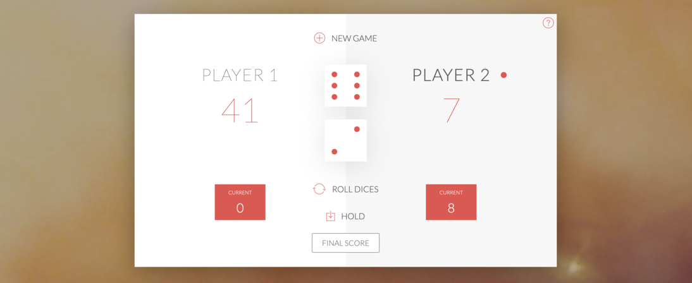

# PigGame

<a target="_blank" href="https://chicager.github.io/PigGame/">Start Game</a><br/>

<br/>

------------

### Rules:
<a target="_blank" href="https://en.wikipedia.org/wiki/Pig_(dice_game)">Wikipedia Reference</a><br/>
```
The game has 2 players, playing in rounds.

In each turn, a player rolls dices as many times as he whishes.
Each result get added to his ROUND (Current) score, BUT if the player rolls a 1 on one of the
dices or on both of them, all his ROUND score gets lost. After that, it's the next player's turn.

The player can choose to 'Hold', which means that his ROUND score gets added to his GLOBAL score.
After that, it's the next player's turn. The winner is the player who reaches the GLOBAL score
set in the score field, if the score is not set then the first player to reach 100 points on
GLOBAL score wins the game.
```
------------

Made mostly with Vanilla JS. Not optimized for mobile devices.